# Class Diagram

## Khon Kaen Procurement Documents Portal

This diagram illustrates the main classes, their attributes, methods, and relationships.

```mermaid
classDiagram
    %% ==========================================
    %% CORE DOMAIN MODELS
    %% ==========================================

    class User {
        +int id
        +string name
        +string email
        +string password
        +string avatar
        +datetime email_verified_at
        +string two_factor_secret
        +string two_factor_recovery_codes
        +datetime two_factor_confirmed_at
        +string remember_token
        +datetime created_at
        +datetime updated_at
        +fill(data) void
        +save() bool
        +delete() bool
        +isDirty(field) bool
        +sendEmailVerificationNotification() void
        +hasVerifiedEmail() bool
    }

    class Announcement {
        +string id
        +string title
        +string organization
        +string category
        +string method
        +number budget
        +string location
        +string publishedAt
        +string deadline
        +AnnouncementStatus status
        +string contactName
        +string contactPhone
        +number referencePrice
        +string description
    }

    class AnnouncementAttachment {
        +string id
        +string name
        +AttachmentType type
        +string size
        +string url
    }

    class Organization {
        +string id
        +string name
        +string shortName
        +OrganizationType type
    }

    class ProcurementMethod {
        +string id
        +string name
        +string code
    }

    %% ==========================================
    %% USER FEATURES
    %% ==========================================

    class Alert {
        +string|number id
        +string name
        +string criteria
        +string organizationName
        +string workType
        +number minBudget
        +string location
        +string color
        +boolean enabled
        +string createdAt
    }

    class NotificationChannel {
        +string id
        +NotificationChannelType type
        +boolean enabled
        +boolean isPro
    }

    class SavedSearch {
        +string id
        +string label
        +string query
        +SearchFilters filters
        +number resultCount
        +string createdAt
    }

    class SearchFilters {
        +string[] organizations
        +string[] methods
        +string[] categories
        +number budgetMin
        +number budgetMax
    }

    class ActivityItem {
        +string id
        +ActivityType type
        +string title
        +string description
        +string timestamp
        +string relatedId
    }

    class UserStats {
        +number activeTracking
        +number savedProjects
        +number pendingSubmissions
        +number downloads
    }

    class AdminStats {
        +number openAnnouncements
        +number pendingReview
        +number expired
    }

    %% ==========================================
    %% FILTER & PAGINATION
    %% ==========================================

    class FilterState {
        +string query
        +number[] budgetRange
        +string[] organizations
        +string[] methods
        +string[] categories
        +SortBy sortBy
    }

    class PaginationMeta {
        +number currentPage
        +number totalPages
        +number totalItems
        +number itemsPerPage
    }

    %% ==========================================
    %% AUTH & SETTINGS
    %% ==========================================

    class Auth {
        +User user
    }

    class TwoFactorSetupData {
        +string svg
        +string url
    }

    class TwoFactorSecretKey {
        +string secretKey
    }

    class TimelineItem {
        +string date
        +string title
        +string description
        +TimelineStatus status
    }

    %% ==========================================
    %% ENUMERATIONS
    %% ==========================================

    class AnnouncementStatus {
        <<enumeration>>
        open
        urgent
        closing
        closed
    }

    class AttachmentType {
        <<enumeration>>
        PDF
        ZIP
        DOC
        XLS
    }

    class OrganizationType {
        <<enumeration>>
        government
        municipality
        university
        hospital
        other
    }

    class NotificationChannelType {
        <<enumeration>>
        email
        in-app
        sms
    }

    class ActivityType {
        <<enumeration>>
        view
        download
        save
        alert
    }

    class SortBy {
        <<enumeration>>
        latest
        budget-high
        budget-low
        deadline
    }

    class TimelineStatus {
        <<enumeration>>
        completed
        current
        upcoming
    }

    %% ==========================================
    %% CONTROLLERS (Backend - Laravel)
    %% ==========================================

    class Controller {
        <<abstract>>
    }

    class ProfileController {
        +edit(request) Response
        +update(request) RedirectResponse
        +destroy(request) RedirectResponse
    }

    class PasswordController {
        +edit(request) Response
        +update(request) RedirectResponse
    }

    class TwoFactorAuthenticationController {
        +show(request) Response
        +store(request) Response
        +destroy(request) RedirectResponse
    }

    %% ==========================================
    %% REQUEST VALIDATORS (Backend - Laravel)
    %% ==========================================

    class ProfileUpdateRequest {
        +rules() array
        +authorize() bool
    }

    class ProfileDeleteRequest {
        +rules() array
        +authorize() bool
    }

    class PasswordUpdateRequest {
        +rules() array
        +authorize() bool
    }

    class TwoFactorAuthenticationRequest {
        +rules() array
        +authorize() bool
    }

    %% ==========================================
    %% MIDDLEWARE (Backend - Laravel)
    %% ==========================================

    class HandleInertiaRequests {
        +share(request) array
        +version() string
    }

    class HandleAppearance {
        +handle(request, next) Response
    }

    %% ==========================================
    %% FRONTEND COMPONENTS (React)
    %% ==========================================

    class AppLayout {
        +children ReactNode
        +render() JSX
    }

    class AuthLayout {
        +children ReactNode
        +render() JSX
    }

    class AppSidebar {
        +navItems NavItem[]
        +render() JSX
    }

    class AppHeader {
        +user User
        +render() JSX
    }

    class DataTable {
        +data T[]
        +columns Column[]
        +emptyMessage string
        +render() JSX
    }

    class StatusBadge {
        +status AnnouncementStatus
        +render() JSX
    }

    class Timeline {
        +items TimelineItem[]
        +render() JSX
    }

    class Pagination {
        +currentPage number
        +totalPages number
        +onPageChange function
        +render() JSX
    }

    %% ==========================================
    %% RELATIONSHIPS
    %% ==========================================

    %% Domain relationships
    User "1" --> "*" SavedSearch : has
    User "1" --> "*" Alert : configures
    User "1" --> "*" ActivityItem : performs
    User "1" --> "1" UserStats : has

    Announcement "1" --> "*" AnnouncementAttachment : contains
    Announcement "*" --> "1" Organization : belongs to
    Announcement "*" --> "1" ProcurementMethod : uses
    Announcement --> AnnouncementStatus : has status

    AnnouncementAttachment --> AttachmentType : has type
    Organization --> OrganizationType : has type

    Alert "1" --> "*" NotificationChannel : notifies via
    NotificationChannel --> NotificationChannelType : has type

    SavedSearch "1" --> "1" SearchFilters : contains

    FilterState --> SortBy : uses

    ActivityItem --> ActivityType : has type
    TimelineItem --> TimelineStatus : has status

    %% Controller relationships
    Controller <|-- ProfileController
    Controller <|-- PasswordController
    Controller <|-- TwoFactorAuthenticationController

    ProfileController ..> ProfileUpdateRequest : validates with
    ProfileController ..> ProfileDeleteRequest : validates with
    ProfileController ..> User : manages

    PasswordController ..> PasswordUpdateRequest : validates with
    PasswordController ..> User : updates

    TwoFactorAuthenticationController ..> TwoFactorAuthenticationRequest : validates with
    TwoFactorAuthenticationController ..> TwoFactorSetupData : returns
    TwoFactorAuthenticationController ..> User : configures

    %% Auth relationships
    Auth --> User : contains

    %% Layout relationships
    AppLayout --> AppSidebar : contains
    AppLayout --> AppHeader : contains

    %% Component relationships
    DataTable --> Pagination : uses
    DataTable --> StatusBadge : displays
```

## Class Categories

### 1. Core Domain Models (โมเดลหลัก)

| Class                    | Description (Thai)                                 | Description (English)                                  |
| ------------------------ | -------------------------------------------------- | ------------------------------------------------------ |
| `User`                   | ข้อมูลผู้ใช้งานระบบ รวมถึงการยืนยันตัวตนแบบสองชั้น | User account data including two-factor authentication  |
| `Announcement`           | ประกาศจัดซื้อจัดจ้าง                               | Procurement announcement                               |
| `AnnouncementAttachment` | เอกสารแนบประกาศ                                    | Announcement attachments (PDF, ZIP, etc.)              |
| `Organization`           | หน่วยงานที่ประกาศจัดซื้อจัดจ้าง                    | Government organization posting announcements          |
| `ProcurementMethod`      | วิธีการจัดซื้อจัดจ้าง                              | Procurement method (e-Bidding, Direct Selection, etc.) |

### 2. User Features (ฟีเจอร์ผู้ใช้)

| Class                 | Description (Thai)                       | Description (English)            |
| --------------------- | ---------------------------------------- | -------------------------------- |
| `Alert`               | เงื่อนไขการแจ้งเตือนที่ผู้ใช้ตั้งค่า     | User-configured alert conditions |
| `NotificationChannel` | ช่องทางการแจ้งเตือน (อีเมล, ในระบบ, SMS) | Notification delivery channels   |
| `SavedSearch`         | การค้นหาที่บันทึกไว้                     | Saved search queries             |
| `SearchFilters`       | ตัวกรองการค้นหา                          | Search filter parameters         |
| `ActivityItem`        | กิจกรรมของผู้ใช้                         | User activity log items          |
| `UserStats`           | สถิติผู้ใช้งาน                           | User statistics                  |
| `AdminStats`          | สถิติผู้ดูแลระบบ                         | Administrator statistics         |

### 3. Backend Controllers (คอนโทรลเลอร์ฝั่ง Backend)

| Class                               | Description (Thai)          | Description (English)              |
| ----------------------------------- | --------------------------- | ---------------------------------- |
| `ProfileController`                 | จัดการโปรไฟล์ผู้ใช้         | Manages user profile CRUD          |
| `PasswordController`                | จัดการรหัสผ่าน              | Manages password updates           |
| `TwoFactorAuthenticationController` | จัดการการยืนยันตัวตนสองชั้น | Manages 2FA setup and verification |

### 4. Frontend Components (คอมโพเนนต์ฝั่ง Frontend)

| Class         | Description (Thai)          | Description (English)             |
| ------------- | --------------------------- | --------------------------------- |
| `AppLayout`   | เลย์เอาต์หลักของแอปพลิเคชัน | Main application layout           |
| `DataTable`   | ตารางแสดงข้อมูล             | Data table component              |
| `StatusBadge` | แสดงสถานะประกาศ             | Announcement status indicator     |
| `Timeline`    | แสดงไทม์ไลน์กิจกรรม         | Timeline component for activities |
| `Pagination`  | แบ่งหน้าข้อมูล              | Pagination component              |

### 5. Enumerations (ค่าคงที่)

| Enum                      | Values                                                | Description       |
| ------------------------- | ----------------------------------------------------- | ----------------- |
| `AnnouncementStatus`      | open, urgent, closing, closed                         | สถานะประกาศ       |
| `AttachmentType`          | PDF, ZIP, DOC, XLS                                    | ประเภทไฟล์แนบ     |
| `OrganizationType`        | government, municipality, university, hospital, other | ประเภทหน่วยงาน    |
| `NotificationChannelType` | email, in-app, sms                                    | ช่องทางแจ้งเตือน  |
| `ActivityType`            | view, download, save, alert                           | ประเภทกิจกรรม     |
| `SortBy`                  | latest, budget-high, budget-low, deadline             | วิธีการเรียงลำดับ |
