# Sequence Diagrams

## Khon Kaen Procurement Documents Portal

This document contains sequence diagrams illustrating key interactions in the system.

---

## 1. User Authentication Flow (การเข้าสู่ระบบ)

### 1.1 Login with Two-Factor Authentication

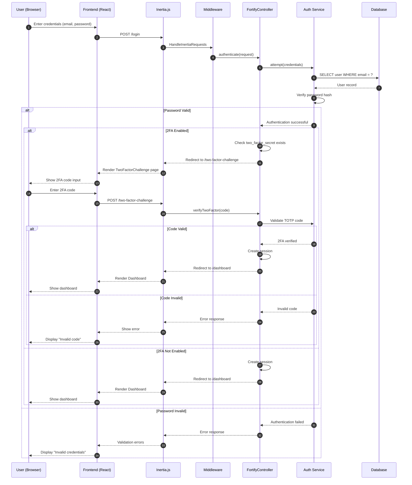

### 1.2 User Registration

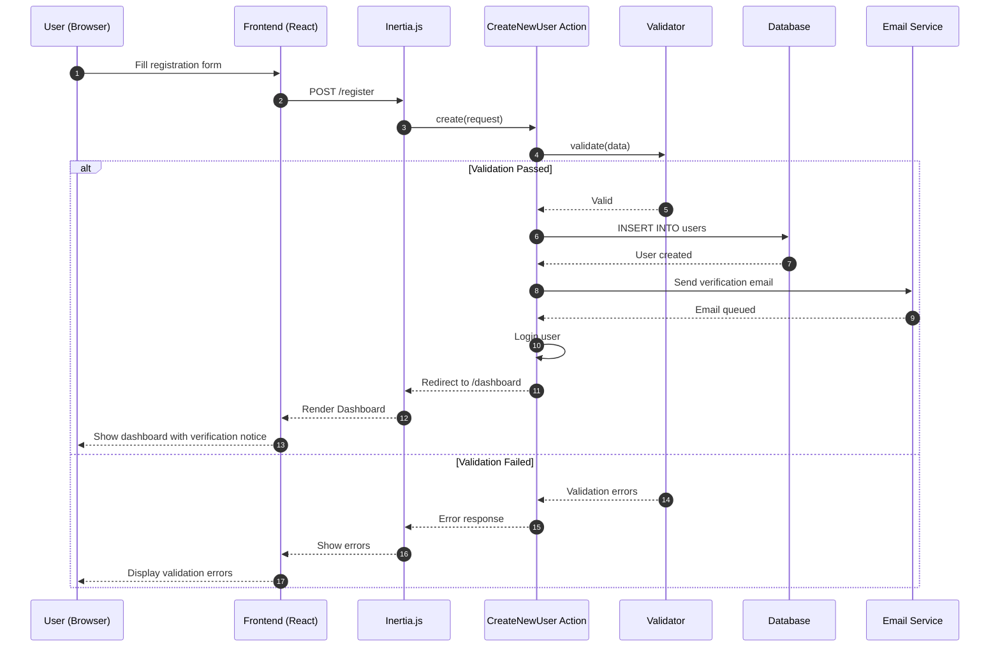

---

## 2. Procurement Search Flow (การค้นหาประกาศ)

### 2.1 Search and Filter Announcements

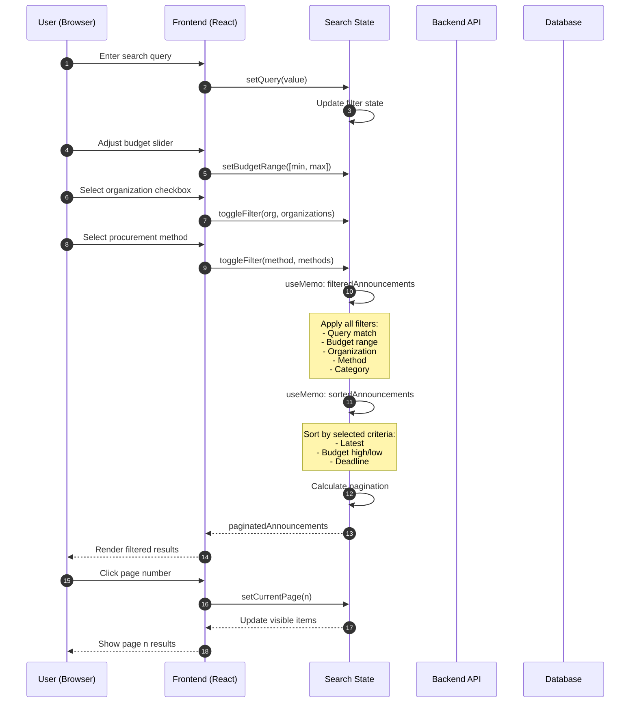

### 2.2 View Announcement Detail

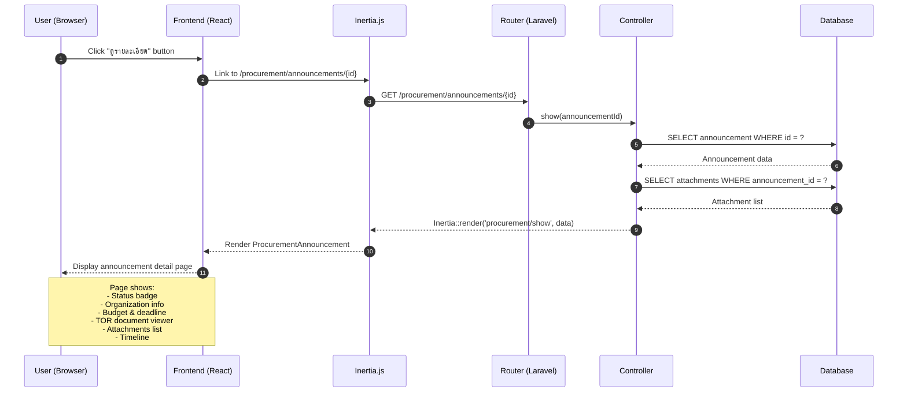

---

## 3. User Profile Management (การจัดการโปรไฟล์)

### 3.1 Update Profile

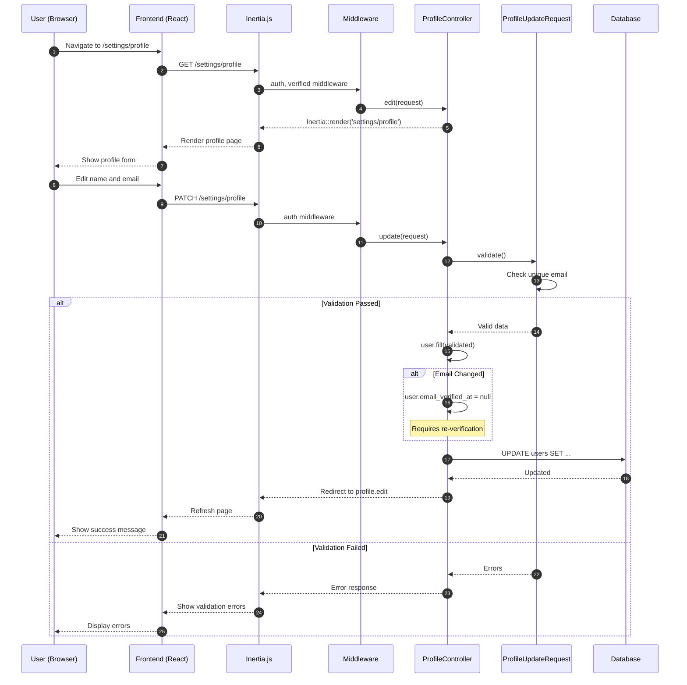

### 3.2 Setup Two-Factor Authentication

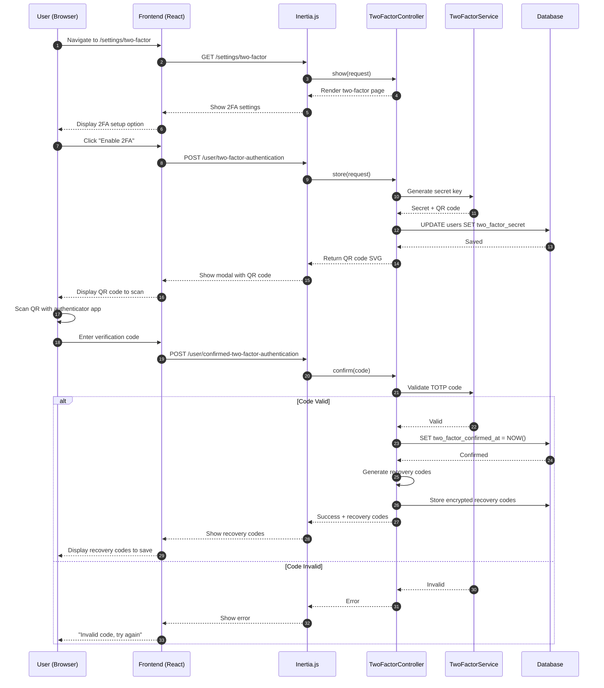

---

## 4. Notification Alert Management (การจัดการการแจ้งเตือน)

### 4.1 Create New Alert

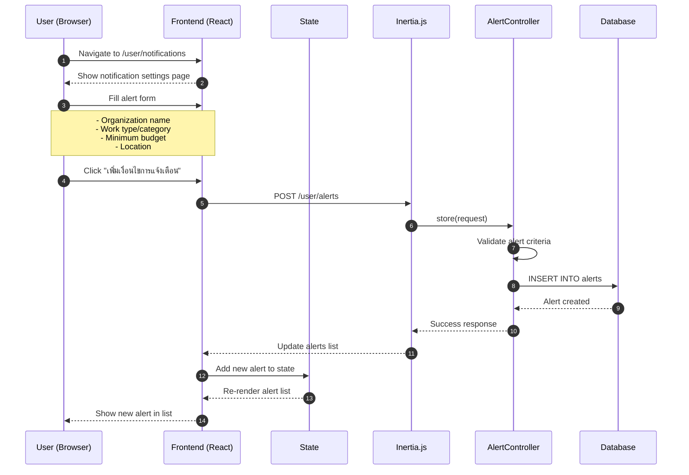

### 4.2 Toggle Notification Channel

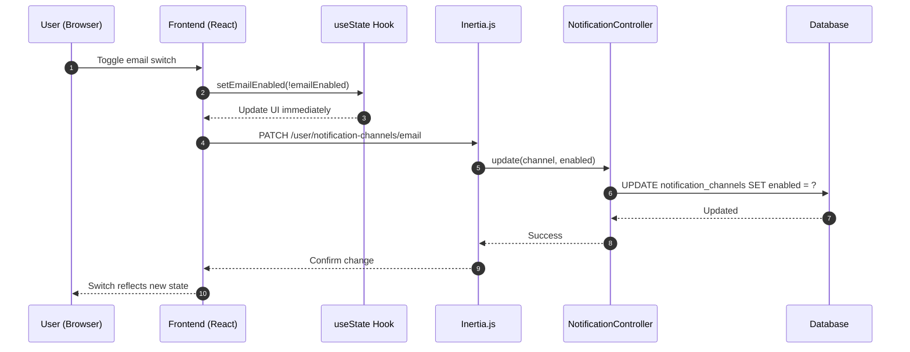

---

## 5. Admin Announcement Management (การจัดการประกาศโดยผู้ดูแล)

### 5.1 Create New Announcement

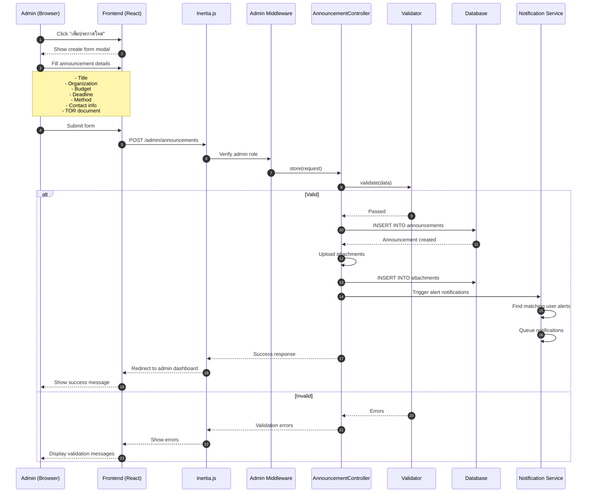

### 5.2 Toggle Announcement Visibility

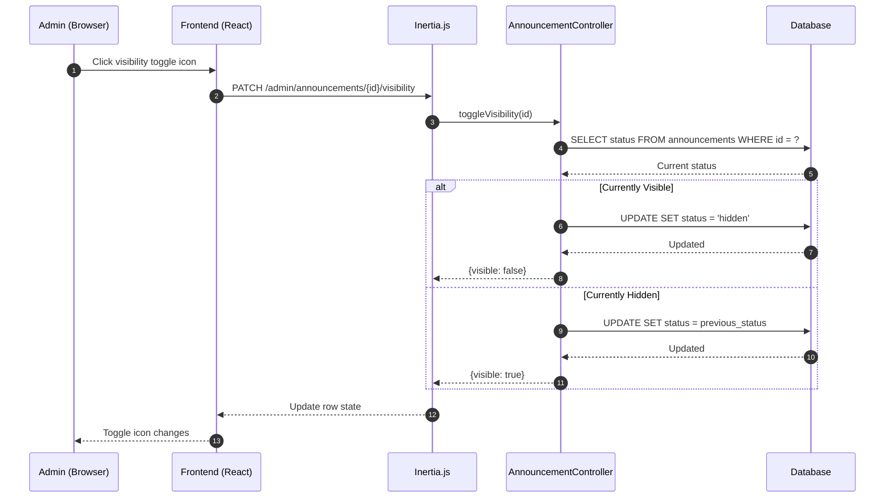

---

## 6. Document Download Flow (การดาวน์โหลดเอกสาร)

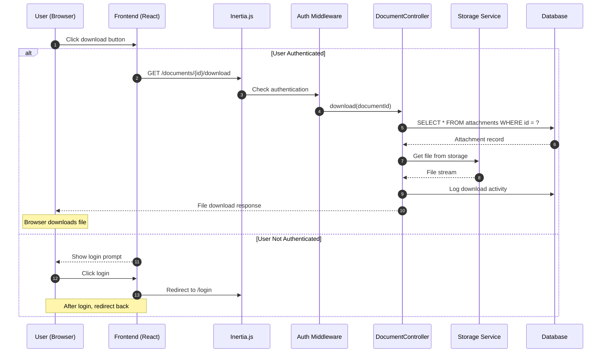
