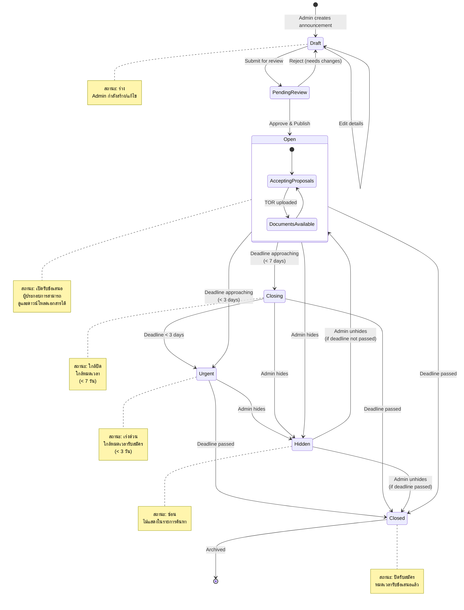
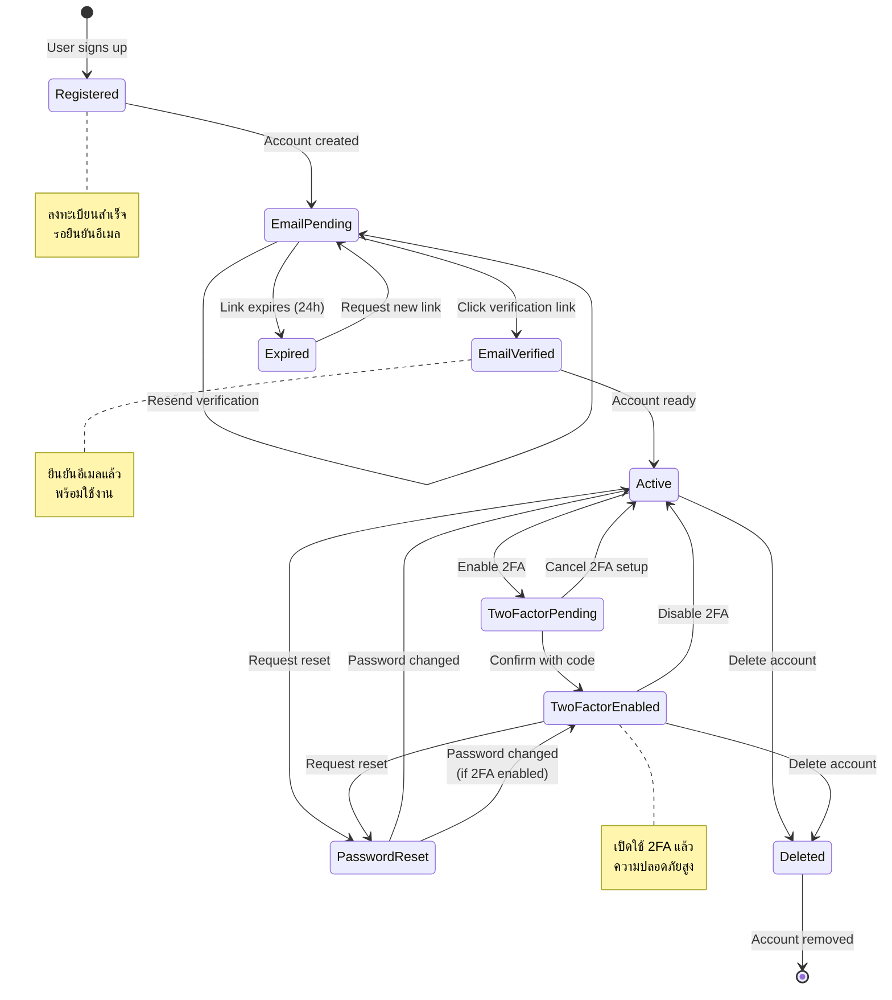
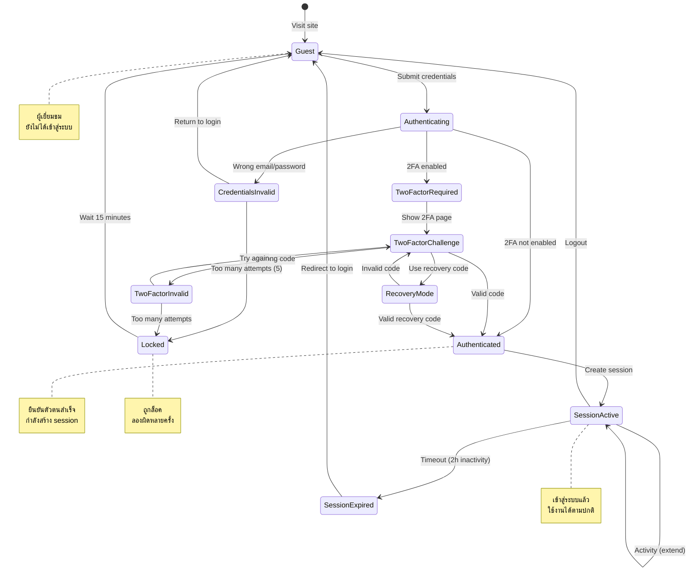
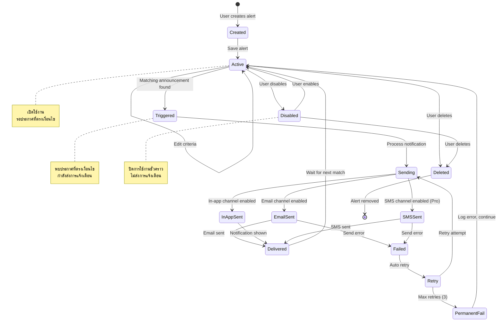
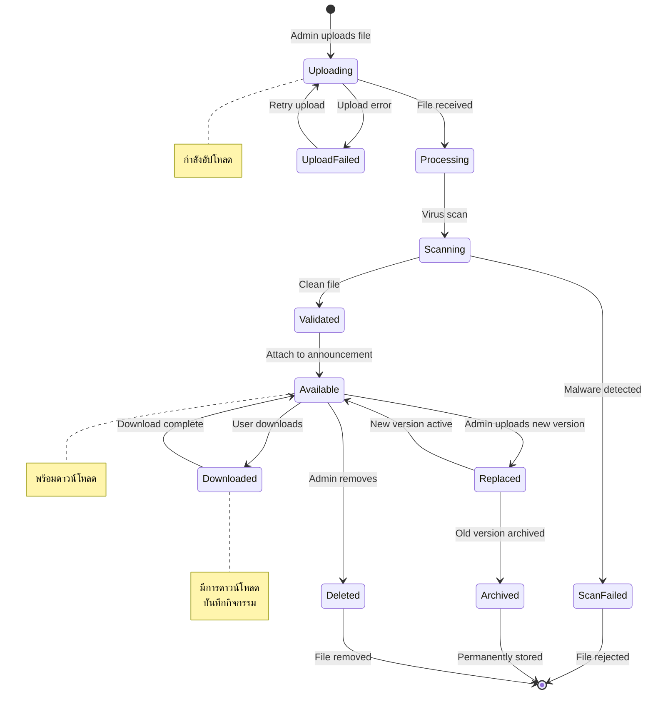
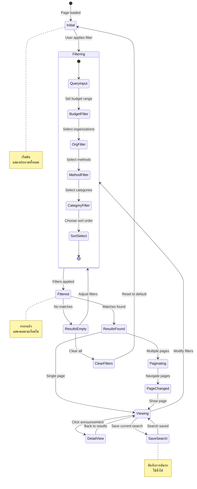
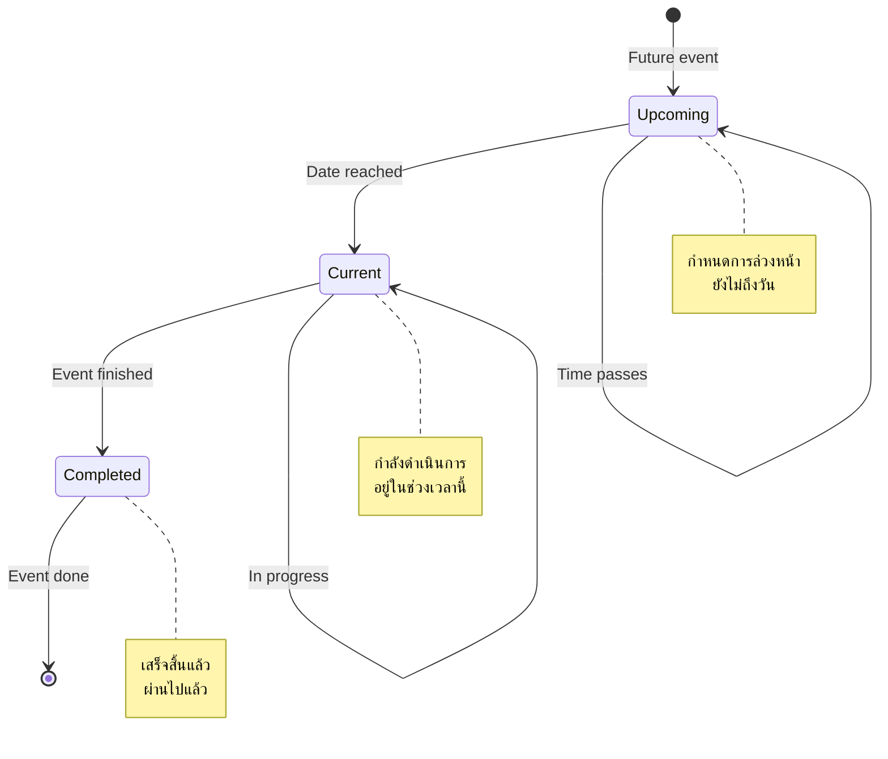

# State Diagrams

## Khon Kaen Procurement Documents Portal

This document contains state diagrams illustrating the lifecycle of key entities in the system.

---

## 1. Announcement Status (สถานะประกาศ)

The main entity with state transitions is the Procurement Announcement.

### Announcement Status Definitions

| Status           | Thai           | Description                     | User Can View | User Can Download |
| ---------------- | -------------- | ------------------------------- | ------------- | ----------------- |
| `draft`          | ร่าง           | Being created/edited by admin   | ❌            | ❌                |
| `pending_review` | รอตรวจสอบ      | Submitted for approval          | ❌            | ❌                |
| `open`           | เปิดรับข้อเสนอ | Active and accepting proposals  | ✅            | ✅                |
| `urgent`         | เร่งด่วน       | Deadline approaching (< 3 days) | ✅            | ✅                |
| `closing`        | ใกล้ปิด        | Deadline approaching (< 7 days) | ✅            | ✅                |
| `closed`         | ปิดรับสมัคร    | Deadline has passed             | ✅            | ✅ (view results) |
| `hidden`         | ซ่อน           | Temporarily hidden by admin     | ❌            | ❌                |

---

## 2. User Account State (สถานะบัญชีผู้ใช้)

### User Account State Definitions

| State                | Thai            | Description                         |
| -------------------- | --------------- | ----------------------------------- |
| `registered`         | ลงทะเบียนแล้ว   | Account created, email not verified |
| `email_pending`      | รอยืนยันอีเมล   | Verification email sent             |
| `email_verified`     | ยืนยันอีเมลแล้ว | Email verified, account active      |
| `active`             | ใช้งานได้       | Full account access                 |
| `two_factor_pending` | รอตั้งค่า 2FA   | 2FA setup in progress               |
| `two_factor_enabled` | เปิด 2FA แล้ว   | 2FA enabled and confirmed           |
| `password_reset`     | รีเซ็ตรหัสผ่าน  | Password reset in progress          |
| `deleted`            | ลบแล้ว          | Account deleted                     |

---

## 3. Authentication Session State (สถานะการเข้าสู่ระบบ)

---

## 4. Alert/Notification State (สถานะการแจ้งเตือน)

### Alert State Definitions

| State       | Thai         | Description                 |
| ----------- | ------------ | --------------------------- |
| `created`   | สร้างแล้ว    | Alert criteria defined      |
| `active`    | เปิดใช้งาน   | Monitoring for matches      |
| `triggered` | ตรงเงื่อนไข  | Matching announcement found |
| `sending`   | กำลังส่ง     | Processing notifications    |
| `delivered` | ส่งแล้ว      | Notification delivered      |
| `failed`    | ส่งไม่สำเร็จ | Delivery failed             |
| `disabled`  | ปิดใช้งาน    | Temporarily disabled        |
| `deleted`   | ลบแล้ว       | Alert removed               |

---

## 5. Document/Attachment State (สถานะเอกสาร)

---

## 6. Filter/Search State (สถานะการกรองค้นหา)

---

## 7. Timeline Item State (สถานะไทม์ไลน์)

Used for announcement schedules and activity timelines.

### Timeline Status Values

| Status      | Thai             | Visual Indicator |
| ----------- | ---------------- | ---------------- |
| `upcoming`  | กำหนดการล่วงหน้า | Gray dot         |
| `current`   | กำลังดำเนินการ   | Blue/Primary dot |
| `completed` | เสร็จสิ้น        | Green dot        |

---

## Summary: Key State Transitions

| Entity            | Primary States                     | Trigger Events                   |
| ----------------- | ---------------------------------- | -------------------------------- |
| **Announcement**  | draft → open → closed              | Admin actions, Time-based        |
| **User Account**  | registered → verified → active     | User actions, Email verification |
| **Auth Session**  | guest → authenticating → active    | Login/Logout actions             |
| **Alert**         | active → triggered → delivered     | Matching announcements           |
| **Document**      | uploading → available → downloaded | Upload/Download actions          |
| **Search Filter** | initial → filtering → filtered     | User filter selections           |
| **Timeline**      | upcoming → current → completed     | Time-based progression           |
