# Use-Case Diagram

## Khon Kaen Procurement Documents Portal

This diagram illustrates the main actors and their interactions with the system.

```mermaid
flowchart TB
    subgraph Actors
        Guest["Guest User<br/>(ผู้เยี่ยมชม)"]
        User["Registered User<br/>(ผู้ใช้งานทั่วไป)"]
        Admin["Administrator<br/>(ผู้ดูแลระบบ)"]
    end

    subgraph "Authentication System"
        UC_Register["Register Account<br/>(ลงทะเบียน)"]
        UC_Login["Login<br/>(เข้าสู่ระบบ)"]
        UC_Logout["Logout<br/>(ออกจากระบบ)"]
        UC_ForgotPwd["Forgot Password<br/>(ลืมรหัสผ่าน)"]
        UC_ResetPwd["Reset Password<br/>(รีเซ็ตรหัสผ่าน)"]
        UC_2FA["Two-Factor Authentication<br/>(ยืนยันตัวตน 2 ชั้น)"]
        UC_VerifyEmail["Verify Email<br/>(ยืนยันอีเมล)"]
    end

    subgraph "Procurement Search & Discovery"
        UC_Search["Search Announcements<br/>(ค้นหาประกาศ)"]
        UC_Filter["Filter by Criteria<br/>(กรองตามเงื่อนไข)"]
        UC_ViewList["View Announcement List<br/>(ดูรายการประกาศ)"]
        UC_ViewDetail["View Announcement Detail<br/>(ดูรายละเอียดประกาศ)"]
        UC_ViewTOR["View TOR Document<br/>(ดูเอกสาร TOR)"]
        UC_Download["Download Documents<br/>(ดาวน์โหลดเอกสาร)"]
    end

    subgraph "User Features"
        UC_Dashboard["View User Dashboard<br/>(แผงควบคุมผู้ใช้)"]
        UC_SaveSearch["Save Search<br/>(บันทึกการค้นหา)"]
        UC_ViewHistory["View Browsing History<br/>(ประวัติการเข้าชม)"]
        UC_TrackAnnouncement["Track Announcements<br/>(ติดตามประกาศ)"]
        UC_Bookmark["Bookmark Announcement<br/>(บันทึกประกาศ)"]
        UC_SetAlert["Set Alert Notifications<br/>(ตั้งการแจ้งเตือน)"]
        UC_ManageAlerts["Manage Alerts<br/>(จัดการการแจ้งเตือน)"]
        UC_NotificationSettings["Notification Settings<br/>(ตั้งค่าการแจ้งเตือน)"]
    end

    subgraph "Profile & Settings"
        UC_ViewProfile["View Profile<br/>(ดูโปรไฟล์)"]
        UC_EditProfile["Edit Profile<br/>(แก้ไขโปรไฟล์)"]
        UC_ChangePassword["Change Password<br/>(เปลี่ยนรหัสผ่าน)"]
        UC_Setup2FA["Setup Two-Factor Auth<br/>(ตั้งค่า 2FA)"]
        UC_DeleteAccount["Delete Account<br/>(ลบบัญชี)"]
        UC_Appearance["Set Appearance<br/>(ตั้งค่าธีม)"]
    end

    subgraph "Admin Features"
        UC_AdminDashboard["Admin Dashboard<br/>(แผงควบคุมผู้ดูแล)"]
        UC_CreateAnnouncement["Create Announcement<br/>(สร้างประกาศ)"]
        UC_EditAnnouncement["Edit Announcement<br/>(แก้ไขประกาศ)"]
        UC_DeleteAnnouncement["Delete Announcement<br/>(ลบประกาศ)"]
        UC_ToggleVisibility["Toggle Visibility<br/>(ซ่อน/แสดงประกาศ)"]
        UC_ReviewDocuments["Review Documents<br/>(ตรวจสอบเอกสาร)"]
        UC_ExportData["Export Data<br/>(ส่งออกข้อมูล)"]
        UC_ManageUsers["Manage Users<br/>(จัดการผู้ใช้)"]
    end

    %% Guest connections
    Guest --> UC_Register
    Guest --> UC_Login
    Guest --> UC_ForgotPwd
    Guest --> UC_Search
    Guest --> UC_Filter
    Guest --> UC_ViewList
    Guest --> UC_ViewDetail
    Guest --> UC_ViewTOR

    %% Registered User connections (inherits Guest capabilities)
    User --> UC_Login
    User --> UC_Logout
    User --> UC_2FA
    User --> UC_VerifyEmail
    User --> UC_Search
    User --> UC_Filter
    User --> UC_ViewList
    User --> UC_ViewDetail
    User --> UC_ViewTOR
    User --> UC_Download
    User --> UC_Dashboard
    User --> UC_SaveSearch
    User --> UC_ViewHistory
    User --> UC_TrackAnnouncement
    User --> UC_Bookmark
    User --> UC_SetAlert
    User --> UC_ManageAlerts
    User --> UC_NotificationSettings
    User --> UC_ViewProfile
    User --> UC_EditProfile
    User --> UC_ChangePassword
    User --> UC_Setup2FA
    User --> UC_DeleteAccount
    User --> UC_Appearance

    %% Admin connections (inherits User capabilities)
    Admin --> UC_AdminDashboard
    Admin --> UC_CreateAnnouncement
    Admin --> UC_EditAnnouncement
    Admin --> UC_DeleteAnnouncement
    Admin --> UC_ToggleVisibility
    Admin --> UC_ReviewDocuments
    Admin --> UC_ExportData
    Admin --> UC_ManageUsers

    %% Include relationships
    UC_ForgotPwd -.->|includes| UC_ResetPwd
    UC_Login -.->|extends| UC_2FA
    UC_Register -.->|includes| UC_VerifyEmail
```

## Actor Descriptions

| Actor               | Description (Thai)                                                         | Description (English)                                         |
| ------------------- | -------------------------------------------------------------------------- | ------------------------------------------------------------- |
| **Guest User**      | ผู้เยี่ยมชมที่ไม่ได้ลงทะเบียน สามารถค้นหาและดูประกาศได้                    | Unregistered visitor who can search and view announcements    |
| **Registered User** | ผู้ใช้งานทั่วไปที่ลงทะเบียนแล้ว สามารถบันทึก ติดตาม และตั้งการแจ้งเตือนได้ | Registered user who can save, track, and set up alerts        |
| **Administrator**   | ผู้ดูแลระบบที่มีสิทธิ์จัดการประกาศและข้อมูลทั้งหมด                         | System administrator with full access to manage announcements |

## Use Case Categories

### 1. Authentication (การยืนยันตัวตน)

- Register, Login, Logout
- Password Recovery (Forgot/Reset)
- Two-Factor Authentication
- Email Verification

### 2. Procurement Discovery (การค้นหาจัดซื้อจัดจ้าง)

- Search by keywords, project ID, organization
- Filter by budget range, organization, method, category
- View announcement list and details
- View TOR documents
- Download attachments

### 3. User Features (ฟีเจอร์ผู้ใช้)

- Personal dashboard with statistics
- Save and manage searches
- View browsing history
- Track announcements
- Bookmark projects
- Set up and manage alert notifications

### 4. Profile & Settings (โปรไฟล์และการตั้งค่า)

- View and edit profile
- Change password
- Setup two-factor authentication
- Delete account
- Set appearance/theme preferences

### 5. Admin Features (ฟีเจอร์ผู้ดูแลระบบ)

- Admin dashboard with statistics
- CRUD operations on announcements
- Toggle announcement visibility
- Review pending documents
- Export data
- Manage users
